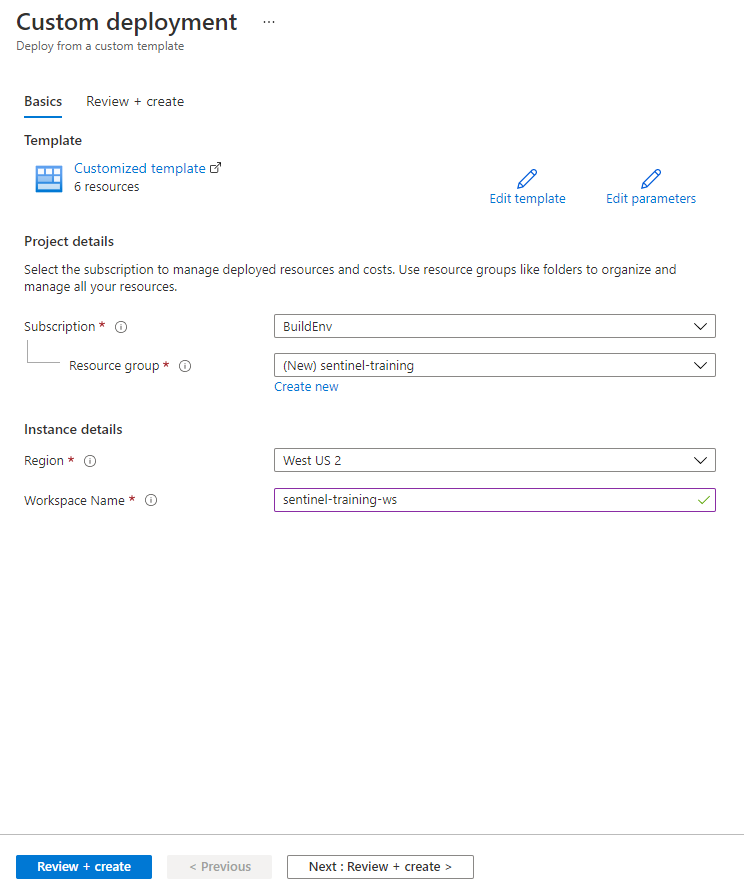
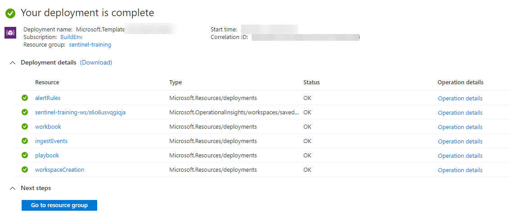
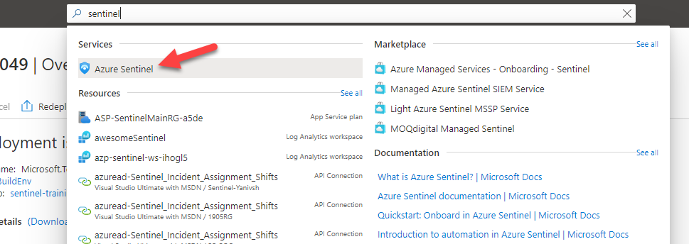
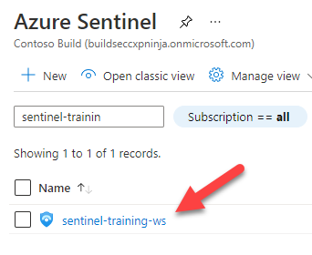
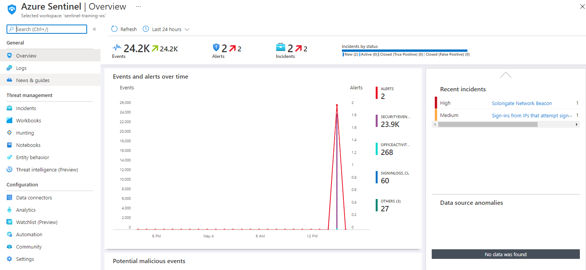

# Module 1 - Setting up the environment

#### 🎓 Level: 100 (Beginner)
#### ⌛ Estimated time to complete this lab: 15 minutes

## Objectives

This module guides you through the deployment of the Azure Sentinel environment that will be used in all subsequent modules.

#### Prerequisites

To get started with Azure Sentinel, you must have a Microsoft Azure subscription. If you do not have a subscription, you can sign up for a free account.

Permissions to create a resource group in your Azure subscription. 

### Exercise 1: Deploy Azure Sentinel Labs ARM template

1. Click on the button below. Make sure that you open it in a new tab so you keep these instructions open.

2. Fill out the defferent fields:
    - **Subscription**: choose the Azure subscription where you would like to deploy the Azure Sentinel lab
    - **Resource Group**: select an existing resource group or create a new resource group (recommended) that will host the lab resources
    - **Region**: from the drop down, select the Azure region where the lab will be located
    - **Workspace Name**: provide a name for the Azure Sentinel workspace. Please note that the workspace name should include 4-63 letters, digits or '-'. The '-' shouldn't be the first or the last symbol
    - **User Name**: Username used to authenticate the playbook with your Azure Sentinel environment. This can be the current username you're logged in with. For example: user1@contoso.com.

3. Click **Review + create** and then **Create** in the next screen. The deployment will start and should take around **15 minutes** to complete. You should see this screen when it finishes.

4. Once finished, go to the search bar at the top and type "sentinel", then click on Azure Sentinel .

5. Choose the workspace name that you selected in step #2. 

6. Congratulations! You have now deployed your Azure Sentinel lab 😊. Your screen should like this:

### Exercise 2: Configure Azure Sentinel Playbook

In this exercise, we will configure a Playbook that will be later used in the lab. This will allow the playbook to access Sentinel.

1. Navigate to the resource group where the lab has been deployed.

2. In the resource group you should see an API Connection resource called *azuresentinel-Get-GeoFromIpAndTagIncident*, click on it.

3. Click on Edi *API connection* under *General*.

4. Click on *Authorize* and a new window will open to chose an account. Pick the user that you want to authenticate with. This should normally be the same user that you're logged in with.

5. Click *Save*.

