# Module 5 - Hunting

#### 🎓 Level: 300 (Intermediate)
#### ⌛ Estimated time to complete this lab: 40 minutes

This module will guide you through a basic incident handling task in Azure Sentinel. This includes pivoting to hunting to collect additional evidence.

#### Prerequisites
This module assumes that you have completed [Module 1](Module-1-Setting-up-the-environment.md), as the data and the artifacts that we will be using in this module need to be deployed on your Azure Sentinel instance.

### Exercise 1: Acknowledge incident

1. If not already there, navigate to *Incidents* view in Azure Sentinel

2. From the list of active incidents, select "Solorigate Network Beacon" incident. If you can't find it, use the search bar or adjust the time filter at the top. Don't worry if you see more than one.

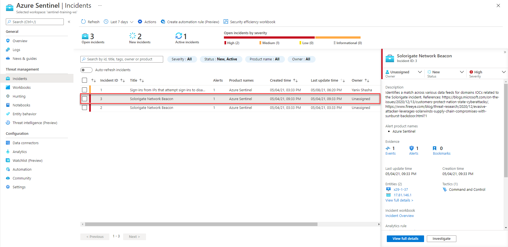

3. Assign the incident to yourself and click *Apply*.

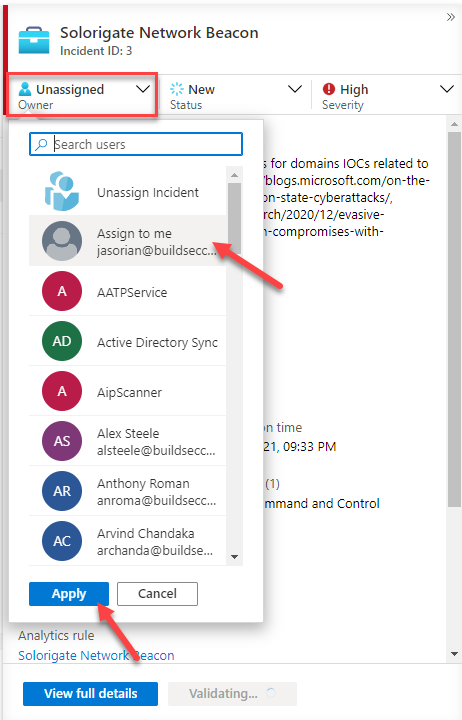

4. Read the description of the incident. As you can see, an IOC related to Solorigate attack has been found. In this case, host **ClientPC** is involved.

### Exercise 2: Hunting for more evidence

1. As a next step, you would like to identify any other hosts that might have been compromised as well. As part of your research, you find the following [guidance from Microsoft](https://techcommunity.microsoft.com/t5/azure-sentinel/solarwinds-post-compromise-hunting-with-azure-sentinel/ba-p/1995095). In this article, you can find a query that will do a SolarWinds inventory check query. We will use this query to find any other affected hosts.

2. Switch to *Hunting* in the Azure Sentinel menu.

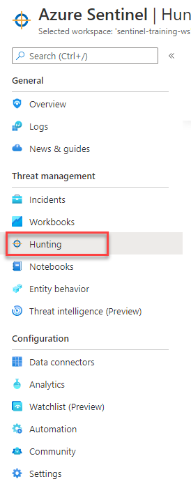

3. In the search box, type "solorigate". Select *Solorigate Inventory check* query and click on *Run Query*.

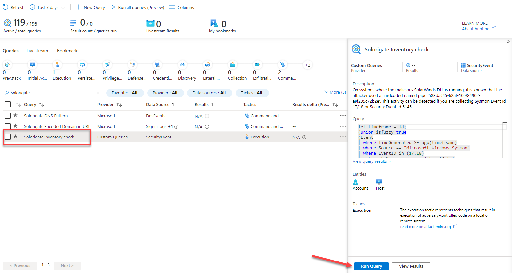

4. You should see a total of three results. Click on *View Results*

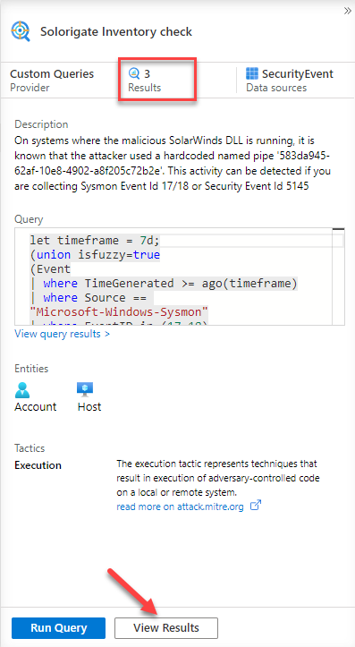

5. As you can see, besides **ClienPC**, there's two additional computers where the malicious DLL and named pipe has been found. Bookmark all three records, selecting them and then click on on *Add bookmark*.

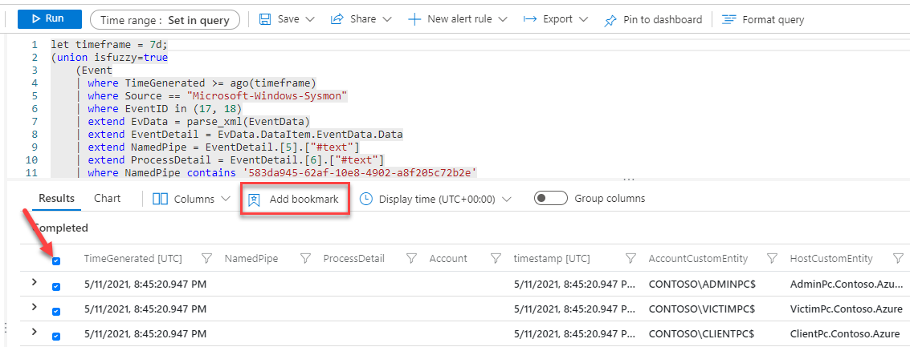

6. In the window that appears click on *Create* to create the bookmarks. As you can see entity mapping to already done for you.

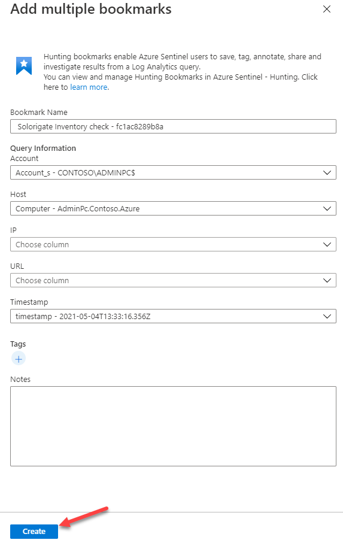

7. Wait until the operation finishes and close the log search using the ✖ at the top right corner. This will land you in the Bookmarks tab inside Hunting menu, where you should see your two new bookmarks created. Select both of them and click on *Incident actions* at the top and then *Add to existing incident*.

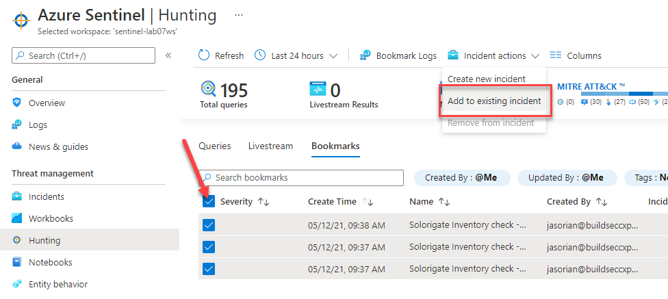

8. From the list, pick the Solorigate incident that is assigned to you, and click *Add*.

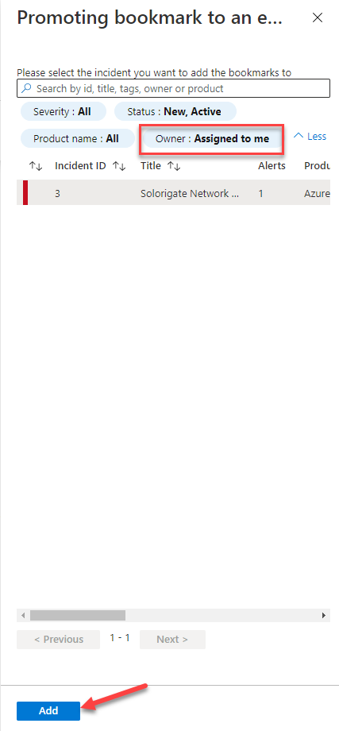

9. At this point you can ask the Operations team to isolate the hosts affected by this incident.

### Exercise 3: Add IOC to Threat Intelligence
Now, we will add the IP address related to the incident to our list of IOCs, so we can capture any new occurrences of this IOC in our logs.

1. Go back to *Incidents* view.

2. Select the Solorigate incident and copy the IP address entity involved. Notice that you have now more computer entities available (the ones coming from the bookmarks).

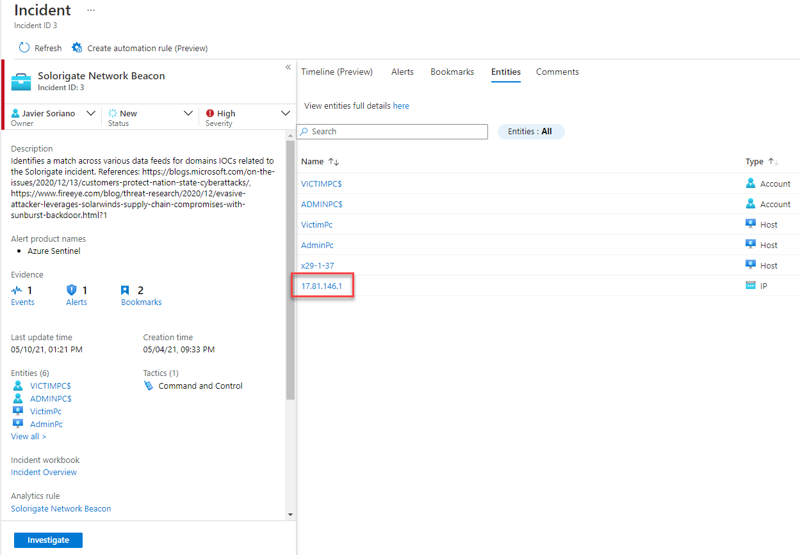

3. Go to the *Threat Intelligence* menu in Azure Sentinel and click *Add new* at the top.

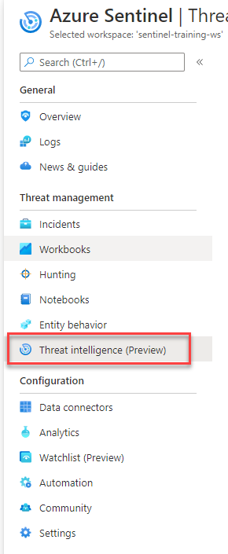

4. Enter the following details in the *New indicator* dialog. Then click *Apply*.

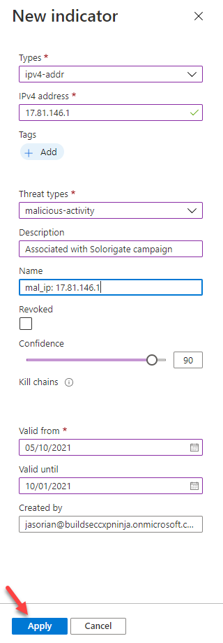

### Exercise 4: Hand over incident
We will now prepare the incident for handover to forensics team.

1. Go to *Incidents* and select the Solorigate incident assigned to you. Click on *View full details*.

2. Move to the *Comments* tab.

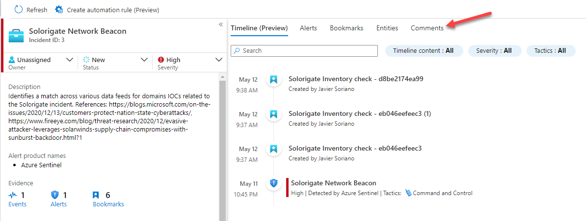

3. Enter information about all the steps performed. As an example:

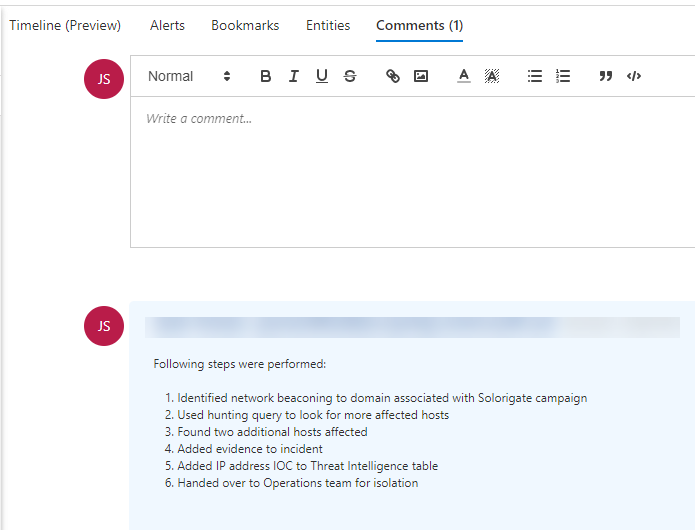

4. At this point you would hand over the incident to forensics team.

**Congratulations, you have completed Module 5!**. You can now continue to **[Module 6 - Watchlists](./Module-6-Watchlists.md)**