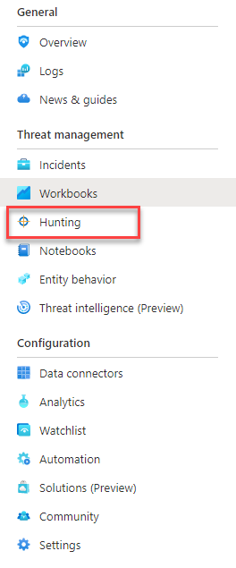
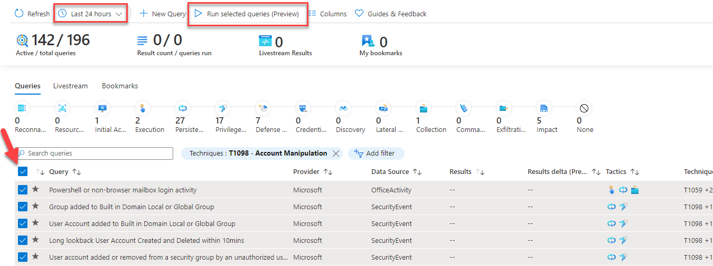

# Module 5 - Hunting
#### 🎓 Level: 300 (Intermediate)
#### ⌛ Estimated time to complete this lab: 40 minutes

This module will guide you through a proactive hunting procedure. and will review Azure sentinel reach hunting features.

#### Prerequisites
This module assumes that you have completed [Module 1](Module-1-Setting-up-the-environment.md), as the data and the artifacts that we will be using in this module need to be deployed on your Azure Sentinel instance.

### Exercise 1: Acknowledge incident

Based on information we got from our security researchers and following the article they shared regarding activity related to the SolarWinds supply chain Identifying https://medium.com/mitre-attack/identifying-unc2452-related-techniques-9f7b6c7f3714 
Our SOC leads understand that to be able to see the full picture of the attack campaign and to spot anomalies on our data set, we need to run a proactive hunting base on the MITRE tactics and techniques describe in this article.

1.	Review the above article that highlight techniques and the corresponding tools and method.
On this exercise we will focus on T1098. to get more understanding on this technique, review this article https://attack.mitre.org/techniques/T1098/ 

2.	On the left navigation press on the Hunting 



3. In the hunting blade we can see all the hunting queries that the product ship with.
On the main menu bar we can see the total queries, and results statistics also other advance features like Livestream and Bookmarks.
On the same top menu we can also find the **Run All queries** button and the column selector menu.


From the information we gain about the attack story from the articles we read, we understand that we need to keep investigating and delve on the ingested logs in Azure Sentinel and the hunting experience need to be a MITRE oriented that will be focus on specific Techniques.
Azure Sentinel comes with Hunting feature that expose rich menu that organize with MITRE driven view, and we can easily pivot and refine the hunting queries based on tactics and technique.


4.	On the **Add filter** select **Techniques** and press **Apply**


5.	On the **Techniques** uncheck the **select all* and only select **T1098**


6.	Review all the relevant for this Techniques.
    In this phase we can multi-select all of queries run them as a batch

To do so, press on the multi-select checkbox and  **Run selected queries (Preview)**

**Note**: in some cases, you will need to modify the selected time range based on the time you deploy the lab.



7.	Press on the query and in the right pane press on **View Results** this will navigate us to the log analytics screen with the raw data.

Once we press on the **Run selected queries (Preview)** the results is start popping on the screen, in our case we intimately spot that the **Adding credentials to legitimate OAuth Applications** query return several of results.

8.	On the **Logs** screen we can see all the data that return from this hunting queries with the parsed fields and columns.

From high overview we can see that we have the actor IP and the username that run this operation.
9.	Expend one of the results and check the fields, as you can see, we are able to spot the Azure AD application name, the added key name and type the IP, username of the actor and other relevant information that help us understand the specific action.

10.	Our SOC analyst need to find a way to know which application from all the above result set is critical and has a security Risk.
One way to do it, is to open Azure active directory open each application from the hunting results check their permissions and validate the risk.
Our SOC analyst open the security playbook and based on the organization knowledge base he understands that our SOC maintain a list for all the AAD application with their risk level.

11.	On the **Logs** screen press on the **+** icon to open a new search tab and run the above query 

 ```powershell
_GetWatchlist('ReferenceTemplate')
   ```

   

   As you can see this watchlist store the application name the Risk level and the permissions.
To be able to correlate it with our hunting results set, we need to run a simple join query.

12.	On the same screen edit the query and join it with the hunting data, copy the above query and run it.

 ```powershell
_GetWatchlist('HighRiskApps')
| join 
(
AuditLogs_CL
| where OperationName has_any ("Add service principal", "Certificates and secrets management")
| where Result_s =~ "success"
| mv-expand target = todynamic(TargetResources_s)
| where tostring(tostring(parse_json(tostring(parse_json(InitiatedBy_s).user)).userPrincipalName)) has "@" or tostring(parse_json(InitiatedBy_s).displayName) has "@"
| extend targetDisplayName = tostring(parse_json(TargetResources_s)[0].displayName)
| extend targetId = tostring(parse_json(TargetResources_s)[0].id)
| extend targetType = tostring(parse_json(TargetResources_s)[0].type)
| extend eventtemp = todynamic(TargetResources_s)
| extend keyEvents = eventtemp[0].modifiedProperties
| mv-expand keyEvents
| where keyEvents.displayName =~ "KeyDescription"
| extend set1 = parse_json(tostring(keyEvents.newValue))
| extend set2 = parse_json(tostring(keyEvents.oldValue))
| extend diff = set_difference(set1, set2)
| where isnotempty(diff)
| parse diff with * "KeyIdentifier=" keyIdentifier: string ",KeyType=" keyType: string ",KeyUsage=" keyUsage: string ",DisplayName=" keyDisplayName: string "]" *
| where keyUsage == "Verify" or keyUsage == ""
| extend AdditionalDetailsttemp = todynamic(AdditionalDetails_s)
| extend UserAgent = iff(todynamic(AdditionalDetailsttemp[0]).key == "User-Agent", tostring(AdditionalDetailsttemp[0].value), "")
| extend InitiatedByttemp = todynamic(InitiatedBy_s)
| extend InitiatingUserOrApp = iff(isnotempty(InitiatedByttemp.user.userPrincipalName), tostring(InitiatedByttemp.user.userPrincipalName), tostring(InitiatedByttemp.app.displayName))
| extend InitiatingIpAddress = iff(isnotempty(InitiatedByttemp.user.ipAddress), tostring(InitiatedByttemp.user.ipAddress), tostring(InitiatedByttemp.app.ipAddress))
| project-away diff, set1, set2, eventtemp, AdditionalDetailsttemp, InitiatedByttemp
| project-reorder
    TimeGenerated,
    OperationName,
    InitiatingUserOrApp,
    InitiatingIpAddress,
    UserAgent,
    targetDisplayName,
    targetId,
    targetType,
    keyDisplayName,
    keyType,
    keyUsage,
    keyIdentifier,
    CorrelationId
| extend
    timestamp = TimeGenerated,
    AccountCustomEntity = InitiatingUserOrApp,
    IPCustomEntity = InitiatingIpAddress
    ) on $left.AppName == $right.targetDisplayName
| where HighRisk == "Yes"
   ```


The results that we see is the application name from the hunting query that having highRisk 
Keep this window open as we will continued to work on it on the next exercise.

### Exercise 2: Add bookmark and create incident from hunting data

Part of our SOC exercise is to use the hunting finding and, in some cases, promote it to an incident.
In our case the action of adding a new key into aa high-risk application is a suspicious operation and we need to make it as evidence and potentially promote it to an incident.


**Congratulations, you have completed Module 5!**. You can now continue to **[Module 6 - Watchlists](./Module-6-Watchlists.md)**