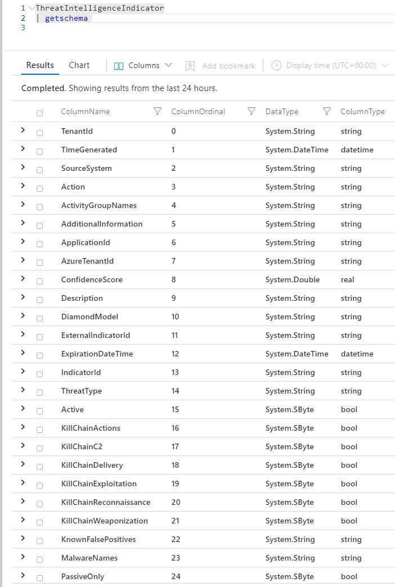

# Module 7 - Threat Intelligence

#### 🎓 Level: 300 (Intermediate)
#### ⌛ Estimated time to complete this lab: 20 minutes

This module will show you how to use Azure Sentinel Thread Intelligence features and all the integration points in the product.
During this model we will use the TI data we ingested on a previews model of this training and will discover how to visualize the data and use it as part of the detection and investigation.


#### Prerequisites
This module assumes that you have completed [Module 1](Module-1-Setting-up-the-environment.md), and also [Module 2]( Module-2-Data-Connectors.md) that enable the TAXII TI connector.
 
 

### Exercise 1: Review our Threat Intelligence data connectors that brings TI IOS's into Azure Sentinel tables.

Our first connector that is currently in public preview is based on a  threat intelligence platform (TIP) solutions.
You can read on the Prerequisites and Instructions on our official docs Connect your threat intelligence platform to Azure Sentinel | Microsoft Docs

**Task 1:**  Review the **Threat Intelligence TIP** connector 

	1. On the left navigation open the connector page and search **hreat Intelligence Platforms (Preview)**
	2. On the bottom right pane press **open connector page**
	3. Review the connector Prerequisites and notify that for enabling this connector the user need to be **global admin** or **security administrator**
	4. Read the configuration section and notice that as part of this connector onboarding the user need to create an AAD app and give it the above permission
	
**Task 2:** Review the **Threat intelligence - TAXII** connector

Our second type of TI connector is based on TAXII, you can read more about the Prerequisites and Instructions on our official docs Connect Azure Sentinel to STIX/TAXII threat intelligence feeds | Microsoft Docs

In  [Module 2]( Module-2-Data-Connectors.md) we already enable the TAXII connector in our lab environment, please refer to this model for more information.


### Exercise 2: Review Thread Intelligence data and the Threat intelligence manage page
As we reviewed in previous model, we have several ways to ingest TI data into Azure sentinel.
You can use one of many available integrated threat intelligence platform (TIP) products, you can connect to TAXII servers to take advantage of any STIX-compatible threat intelligence source, and you can also make use of any custom solutions that can communicate directly with the Microsoft Graph Security tiIndicators API.
The ingested data store in a dedicated table name **ThreatIntelligenceIndicator** and visible on the Threat Intelligence page on the left navigation.

**Task 1:**  Review the TI data into Azure Sentinel Logs interface.
1.On the left navigation press **Logs**, this will redirect us to the Log analytics query interface. On the query interface we can see on the left side the tables with the relevant fields.
2. Azure Sentinel Build-in tables are strongly type schema, To be able to see the ThreatIntelligenceIndicator schema, run the above query: 
 ```powershell
 ThreatIntelligenceIndicator
| getschema
   ```



3.	First let's explore and delve into the TI table, we will do that by running the above query:

we want to take sample data and expand one of the results

 ```powershell
ThreatIntelligenceIndicator
| take 10
   ```
To understand if specific IOC is active, we need to have closer look on the above columns

- ExpirationDateTime [UTC]
- Acitve 

On our example, we can see that the IOC is an IP that is active with future Expiration date
This mean that our matching detection rule will take this IOC in consideration when we will do the correlation with your data sources. 


**Task 2:** Review and manage TI IOC's in Azure Sentinel Threat intelligence manage page


### Exercise 1: TI detection (blackbox + TI matching)


##Task 2:Review and manage TI IOC's in Azure Sentinel Threat intelligence manage page


### Exercise 1: TI detection (blackbox + TI matching)
