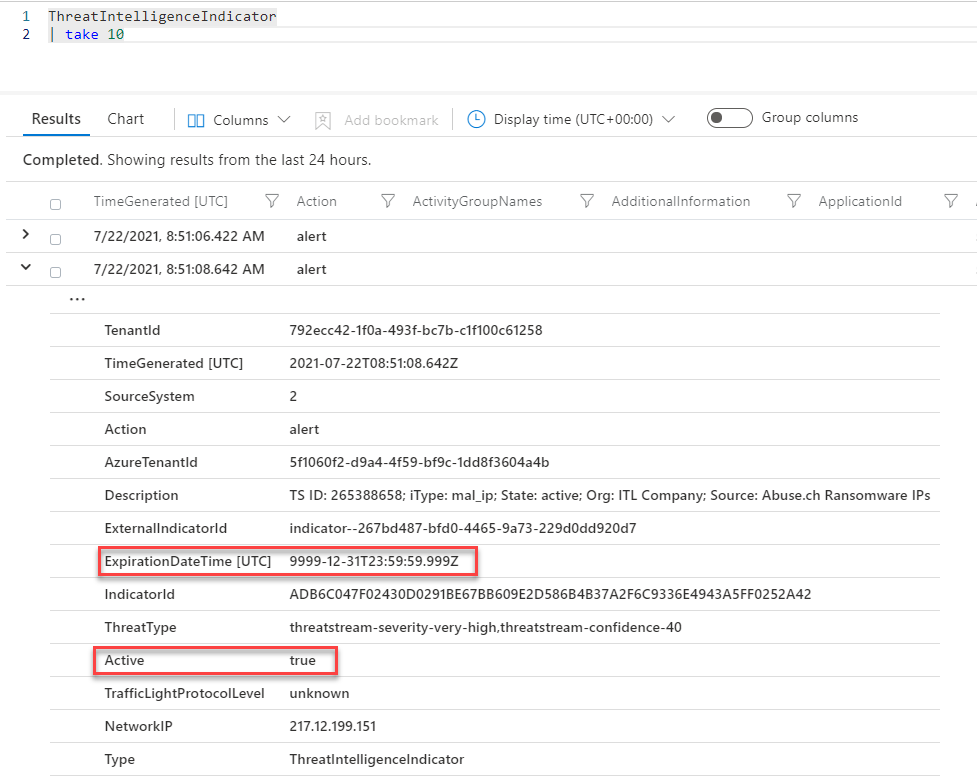

# Module 7 - Threat Intelligence

#### 🎓 Level: 300 (Intermediate)
#### ⌛ Estimated time to complete this lab: 20 minutes

This module will show you how to use Azure Sentinel Threat Intelligence (TI) features and all the integration points in the product.
During this module we will use TI data we ingested in [Module 2](Module-2-Data-Connectors.md) of this training, and will discover how to visualize the data and use it as part of the detection and investigation.


#### Prerequisites
This module assumes that you have completed [Module 1](Module-1-Setting-up-the-environment.md), and also [Module 2](Module-2-Data-Connectors.md) that enables the Threat Intelligence TAXII connector.
 

### Exercise 1: Threat Intelligence data connectors

For detailed prerequisites and instructions for this connector, you can visit our official doc on this matter [Connect your threat intelligence platform to Azure Sentinel](https://docs.microsoft.com/en-us/azure/sentinel/connect-threat-intelligence-tip).

#### Task 1 : Threat Intelligence Platforms (TIP) connector 

<<<<<<< HEAD
This connector is currently in public preview and is based on Third-party Threat Intelligence platform (TIP) solutions like PaloAlto MineMeld, ThreatConnect and others.
=======
**Task 1:**  Review the **Threat Intelligence TIP** connector 
>>>>>>> 02ae06ad2dcbcc8ad0f0363f36bba265bc352c77

1. On the left navigation open the connector page and search **Threat Intelligence Platforms (Preview)**
2. On the bottom right pane press **Open connector page**
3. Review the connector Prerequisites and notice that to enable this connector, the user need to be **Global Admin** or **Security Administrator** in the current Azure AD tenant
4. Read the configuration section and notice that as part of this connector onboarding, the user needs to create an Azure AD app registration and grant one of the permissions above
	
<<<<<<< HEAD
#### Task 2 : Threat intelligence TAXII connector

For detailed prerequisites and instructions for this connector, you can visit our official doc on this matter [Connect Azure Sentinel to STIX/TAXII threat intelligence feeds](https://docs.microsoft.com/en-us/azure/sentinel/connect-threat-intelligence-taxii)

In [Module 2](Module-2-Data-Connectors.md) we already enabled the TAXII connector in our lab environment, please refer to this module for more information.
=======
**Task 2:** Review the **Threat intelligence - TAXII** connector
>>>>>>> 02ae06ad2dcbcc8ad0f0363f36bba265bc352c77


### Exercise 2: Explore the Threat Intelligence menu

As we discussed in the previous exercise, we have several ways to ingest TI data into Azure Sentinel. You can use one of the many available integrated Threat Intelligence Platform (TIP) products or you can connect to TAXII servers to take advantage of any STIX-compatible threat intelligence source. There is an additional option whic allows you to bring any custom TI feed using the Microsoft Graph Security tiIndicators API.

The ingested Indicators of Compromise coming from these TI feeds, is stored in a dedicated table called **ThreatIntelligenceIndicator** and visible on the Threat Intelligence menu on the left navigation.

#### Task 1: Review the TI data into Azure Sentinel Logs interface.

1. On the left navigation click on **Logs**, this will redirect you to the Log Analytics query interface. On the query interface we can see on the left side the tables with the relevant fields.
2. Azure Sentinel built-in tables have a pred-efined schema, to be able to see the **ThreatIntelligenceIndicator** schema, run the following query: 

 ```powershell
 ThreatIntelligenceIndicator
| getschema
   ```


3.	Let's explore and delve into the TI table. Run the following query which takes 10 records from the table:

 ```powershell
ThreatIntelligenceIndicator
| take 10
   ```

To understand if a specific IOC is active, we need to have closer look at the following columns>

**ExpirationDateTime [UTC]**

**Acitve** 

On our example, we can see that the IOC is an IP that is active with future Expiration date. This means that our matching detection rule will take this IOC into consideration when correlating with data sources. 




#### Task 2: Review and manage TI IOC's in Azure Sentinel Threat intelligence menu


### Exercise 3: Analytics Rules based on Threat Intelligence data

#### Task 1: Review and enable TI mapping analytics rules

#### Task 2: Review and enable Threat Intelligence Matching Analytics rule


### Exercise 5: TI workbook
